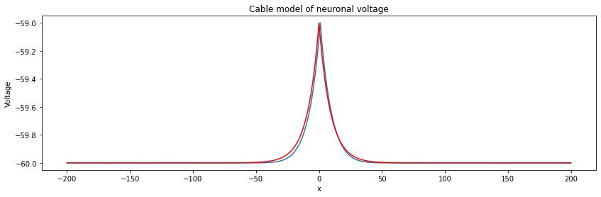

# Cable-Theory-Simulation

## This was a part of my 4th year essay

I investigated cable theory as it was necessary in understanding how the voltage moves through the neurons.

### Here is a comparison between the Cable theory(Red) and the simulation of voltage diffusion(Blue)

